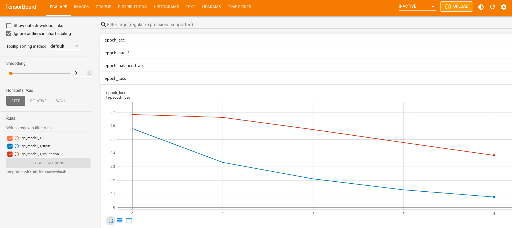
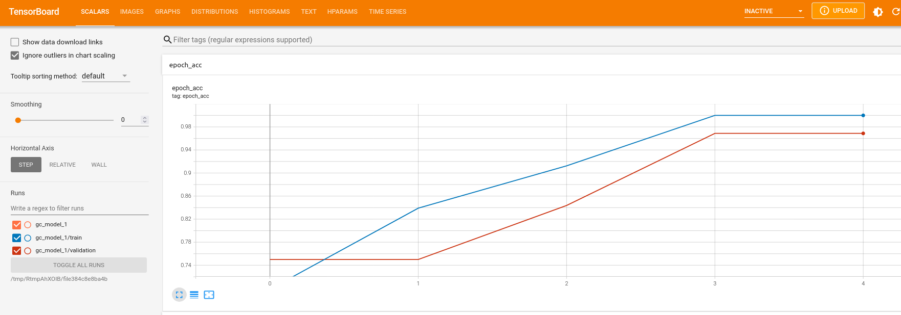
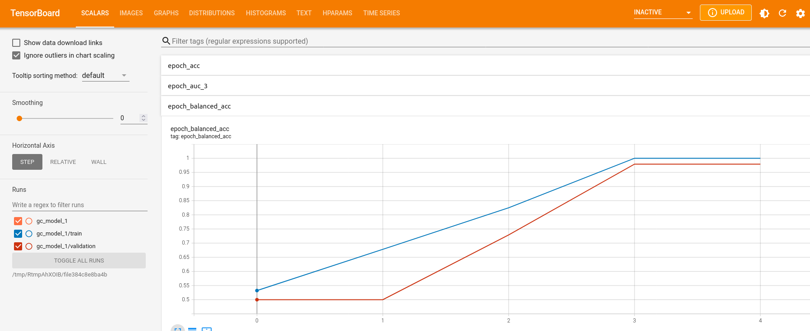
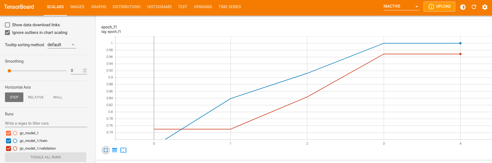
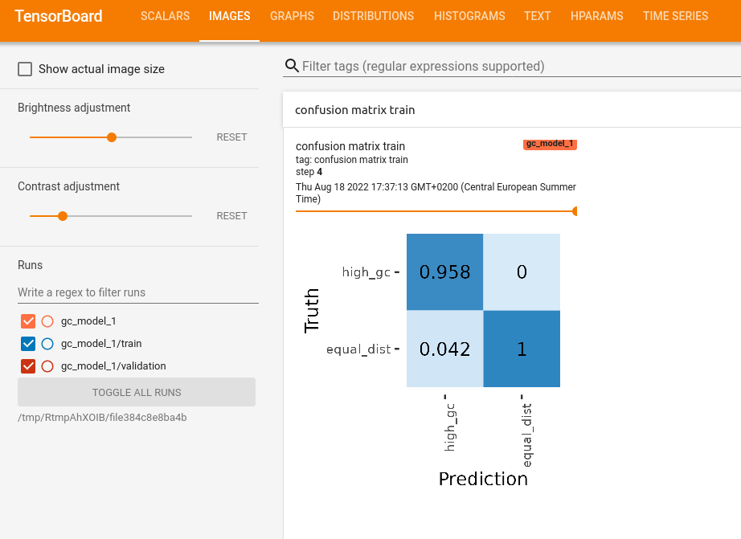
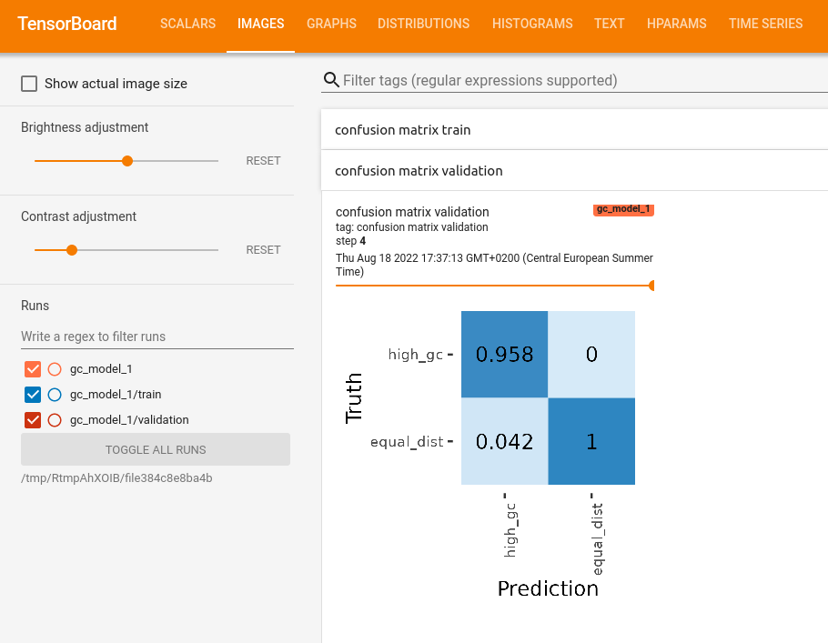
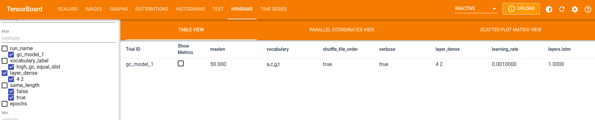

```{r, eval=FALSE, message=FALSE}
# devtools::install_github("GenomeNet/deepG")
library(deepG)
library(magrittr)
```

```{r, echo=FALSE, warning=FALSE, message=FALSE}
#devtools::load_all(path = "~/deepGdev")
#devtools::install_github("GenomeNet/deepG")
library(deepG)
library(magrittr)

if (!reticulate::py_module_available("tensorflow")) {
  knitr::opts_chunk$set(eval = FALSE)
} else {
  knitr::opts_chunk$set(eval = TRUE)
}
```

```{r, echo=FALSE, warning=FALSE, message=FALSE}
options(rmarkdown.html_vignette.check_title = FALSE)
```

```{css, echo=FALSE}
mark.in {
  background-color: CornflowerBlue;
}

mark.out {
  background-color: IndianRed;
}

```


Tensorflow offers the <a href="https://www.tensorflow.org/tensorboard">Tensorboard</a> application to visualize the training process of our networks. DeepG expands on some of the default Tensorboard options and implements some custom settings.
We train again a model that can differentiate sequences based on the GC content, as described in the <a href="getting_started.html">Getting started tutorial</a>.

We start by creating our data. To show the difference between accuracy and balanced accuracy, we create 3 times more data with high GC content. 

```{r warning = FALSE}
set.seed(123)
vocabulary <- c("A", "C", "G", "T")

data_type <- c("train", "validation")

for (i in 1:length(data_type)) {
  
  temp_file <- tempfile()
  assign(paste0(data_type[i], "_dir"), temp_file)
  dir.create(temp_file)
  
  for (j in 1:6) {
    
    if (j %% 2 == 1) {
      header <- "high_gc"
      prob <- c(0.1, 0.4, 0.4, 0.1)
    } else {
      header <- "equal_dist"
      prob <- rep(0.25, 4)
    }
    fasta_name_start <- paste0(header, "_", data_type[i])
    
    create_dummy_data(file_path = temp_file,
                      num_files = 2,
                      seq_length = 100, 
                      num_seq = ifelse(j %% 2 == 1, 6, 2), # create more sequences for high GC content
                      header = header,
                      prob = prob,
                      fasta_name_start = fasta_name_start,
                      vocabulary = vocabulary)
  }
  
}
```

```{r warning = FALSE}
list.files(train_dir)
list.files(validation_dir)
```

To use tensorboard, we first need to create a folder where we store our tensorboard logs. 

```{r warning = FALSE}
# create folder for tensorboard logs
tb_dir <- tempfile()
dir.create(tb_dir)
```

When creating our model, we can add some additional metrics to observe like AUC, F1 and balanced accuracy.

```{r warning = FALSE}
maxlen <- 50
model <- create_model_lstm_cnn(maxlen = maxlen,
                               filters = c(8),
                               kernel_size = c(12),
                               pool_size = c(3),
                               layer_lstm = 8,
                               auc_metric = TRUE,
                               f1_metric = TRUE,
                               bal_acc = TRUE,
                               layer_dense = c(4, 2),
                               model_seed = 3)
```

Finally we can train the model.

```{r warning = FALSE, eval=FALSE}
hist <- train_model(model,
                    train_type = "label_header",
                    run_name = "gc_model_1",
                    path = train_dir,
                    path_val = validation_dir,
                    epochs = 5,
                    steps_per_epoch = 2, # 20
                    batch_size = 64,
                    step = 50, 
                    path_tensorboard = tb_dir, # path to tensorboard logs
                    tb_images = F, # show confusion matrix in tensorboard
                    vocabulary_label = c("high_gc", "equal_dist"))
                    
plot(hist)
```

Use the following command to open tensorboard in a browser:

```{r warning = FALSE, eval=FALSE}
keras::tensorboard(tb_dir)
```

We can observe the scores for loss, accuracy, balanced accuracy, F1 and AUC under the "SCALARS" tab. 










We can also observe how the learning rate might have changed 


In the "training files seen" window, we can observe how often we iterated over the training files.


In the "IMAGES" tab we can see a confusion matrix for the train and validation scores for every epoch






In the "HPARAM" tab you can see hyper parameters of each run 


